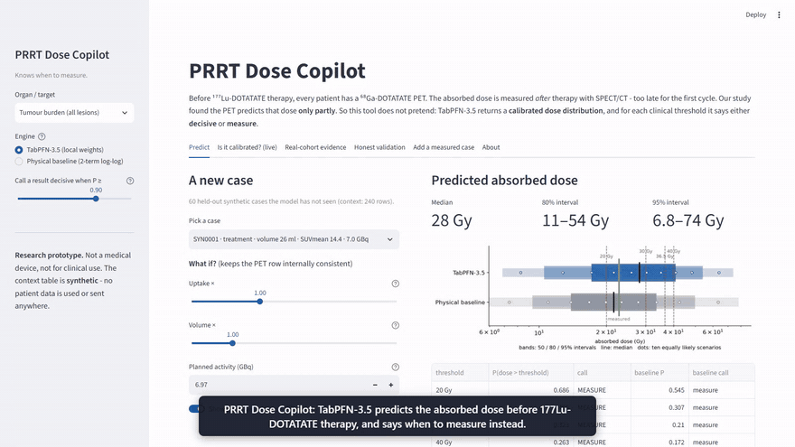
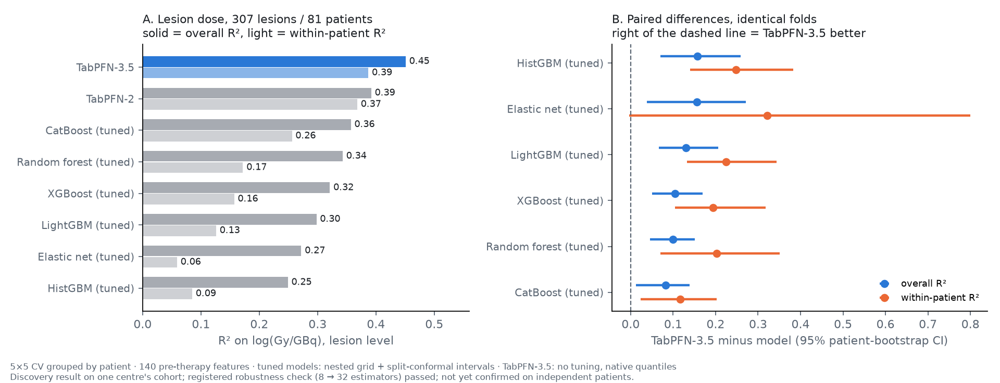
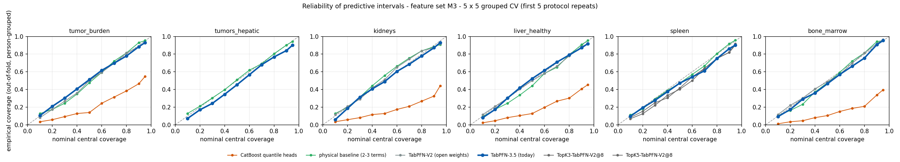

# PRRT Dose Copilot — a dose predictor that knows when to measure

**TabPFN-3.5 predicts the radiation dose a tumour or organ will absorb in ¹⁷⁷Lu-DOTATATE therapy, from the
pre-therapy ⁶⁸Ga-DOTATATE PET, and says when its prediction is not good enough and the dose must be measured.**
For every organ and lesion it returns a predictive distribution, the probability of crossing a clinical
threshold, and a call: **decisive** or **measure**.

[](../../actions/workflows/ci.yml)


**Demo video (2.5 min):** [YouTube](https://youtu.be/vaRp2va6-Js) · [file](docs/demo.mp4) — every tab, with TabPFN-3.5 running · **Run it:** [three commands](#run-it) ·
**Check every number below:** `python scripts/verify_claims.py`

> Research prototype built for the Prior Labs TabPFN-3.5 Hackathon. **Not a medical device. Not for clinical use.**
> The app runs on a **synthetic** cohort. Results on the real cohort are published as aggregates only.

[](docs/demo.mp4)

*Fourteen seconds of the Predict tab. The full walk-through is [docs/demo.mp4](docs/demo.mp4); a still is in [docs/screenshot.png](docs/screenshot.png).*

---

## Results at a glance

Real cohort: one centre, cycle-1 treatments, dose measured by post-therapy SPECT/CT. Cross-validation
**grouped by patient** (no patient on both sides of a split), identical folds for every model, 95% CIs from a
patient-level paired bootstrap. TabPFN-3.5 is **untuned** and uses its **native** quantiles.

| question | TabPFN-3.5 | best conventional model | source |
|---|---|---|---|
| Lesion dose, 140-feature table: R² (log) | **0.451** | 0.357 — CatBoost, nested-tuned (six tuned models: 0.249–0.357). The 2-term physical model scored 0.372 in a separate 17-feature run ([§2](#2-why-the-accuracy-result-depends-on-the-feature-set)); no paired test against it at this table size | [lesion_8models](results/real_cohort/lesion_8models_2026-10-03/) |
| Difference vs tuned CatBoost | **+0.082 [+0.013, +0.139]**; registered re-check at 32 estimators: **+0.079 [+0.011, +0.136]** | the CI excludes 0 against all six tuned models | same |
| Ranking the lesions *within* one patient (within-patient R²) | **0.387** | 0.059–0.256 | same |
| Whole distribution (CRPS, log, lower is better) | **0.387** | 0.416 (CatBoost); CI of the difference excludes 0 against all six | same |
| Lesion intervals, 80 / 95% coverage | **0.80 / 0.94**, no calibration step | 0.793 / 0.951 for CatBoost, *after* split-conformal calibration | same |
| Treatment-level 95% coverage, 17 PET features, no calibration step | **0.91–0.97** | 0.36–0.63 — tuned CatBoost with quantile heads | [v35_2026-10-06](results/real_cohort/v35_2026-10-06/) |
| Treatment level, ~165 columns: whole distribution (CRPS) against tuned CatBoost, 4 targets | **18–23% lower**, every CI excludes 0; 95% coverage **0.92–0.95** | 95% coverage 0.40–0.55 — tuned CatBoost with quantile heads | same |
| Tumour-burden threshold calls: share decisive / share of those right | 19–34% / **93–97%** | 66–73% / 77–87% — tuned CatBoost | same |



**Status.** The lesion-level result is a **discovery result that passed a registered robustness check**, not
a confirmed one. The 8-model comparison was not registered in advance, and TabPFN-3.5 was the eighth model
examined on these patients. The confirmatory test is registered: about 100 new patients if the true advantage is
+0.08, about 390 if it is half that. Against
TabPFN-2 nothing is resolvable. "Registered" here means a dated registration file written before the re-run (a transcription without patient identifiers is in the results folder); it was not lodged on a public registry. The full list of limits is in [Scope](#scope-what-we-do-not-claim).

---

## The problem

Peptide receptor radionuclide therapy (PRRT, ¹⁷⁷Lu-DOTATATE) is given at a fixed activity, although the
absorbed dose per GBq varies several-fold between patients. The dose is *measured* after therapy with
SPECT/CT: extra hospital visits, days later, too late for the first cycle. Predicting it from the
pre-therapy PET has been tried many times. Published R² values for PRRT run from 0.24 to 0.64
(0.87 for the related ¹⁷⁷Lu-PSMA therapy), and they sort by how leniently the model was validated:
the two studies that held out whole patients or centres report 0.24 and 0.25.

On our cohort the PET predicts the dose **only partly**. So the useful product is not "a dose predictor".
It is a tool that says, per organ and per lesion, either *"the prediction is decisive at your threshold"*
or *"it is not — measure"*. That works only if the predictive distribution is **calibrated** and as
**sharp** as the data allow. Those are the two properties we measured for TabPFN-3.5.

## What the app does

| tab | what you see |
|---|---|
| **Predict** | Pick a held-out case, or change uptake and volume with what-if sliders. You get the dose distribution (50 / 80 / 95% intervals and ten equally likely scenarios), P(dose > threshold) at the study's clinical thresholds, and the call: decisive or measure. The physical baseline is shown beside it, along with how far this target can be trusted on the real cohort. |
| **Is it calibrated? (live)** | Grouped 5-fold CV on the context table, run live on identical folds for four models: TabPFN-3.5, the physical baseline, gradient boosting with quantile heads, and gradient boosting nested-tuned with split-conformal intervals. It shows a reliability curve and a **risk–coverage curve**: the share of threshold calls made decisive against the share of those calls that were right. |
| **Real-cohort evidence** | The lesion-level 8-model comparison, the calibration tables, and the decisive-call chart, all read from the CSVs in `results/real_cohort/`. |
| **Honest validation** | The same model on the same data, split at random and split by patient. |
| **Add a measured case** | One more context row. The next prediction already uses it, with no training step. |
| **About** | What the tool is, the engine settings, and where the data come from. |

## How TabPFN-3.5 is used

| capability | where |
|---|---|
| **Full predictive distribution.** `output_type="quantiles"` on a 1–99% grid. The target is log(Gy/GBq); quantiles are back-transformed, and a mean is never exponentiated. | `copilot/engine.py` |
| **Zero tuning.** 8 estimators and the default checkpoint; nothing is tuned. The comparators get a nested tuning grid; TabPFN-3.5 gets none. | everywhere |
| **Calibrated without a calibration split.** With about 80 patients, a calibration split costs data the cohort does not have. | results above |
| **In-context update.** A newly measured case is one more row. | app → *Add a measured case* |
| **`fit_with_cache`** through the Prior Labs API, so repeated predictions on one context are served from a server-side cache. Every prediction in the app is one live call. If the API errors, the engine retries and re-sends the context; if it still fails, the app shows the physical baseline with a notice, never a traceback. | `TabPFN35(mode="api")` |
| **Offline local weights.** The real-cohort numbers were produced offline from local weights, with no network calls; no patient-level data was sent to the Prior Labs API. | `research/`, `TabPFN35(mode="local")` |

## Real-cohort findings in detail

### 1. Lesion dose with a wide table: TabPFN-3.5 against six tuned models

The data are 307 lesions in 85 treatments of 81 patients, with 140 pre-therapy columns: the lesion's own PET, the PET of the
whole body and the other organs, treatment, and body size. The protocol is 5 × 5-fold CV grouped by patient. Each
conventional model (CatBoost, XGBoost, HistGradientBoosting, LightGBM, random forest, elastic net) is
**nested-tuned**: an inner patient-grouped 3-fold CV picks one of four settings. Each gets **split-conformal**
intervals from its inner out-of-fold residuals. Design, grids, every CSV and both registration documents
are in [`results/real_cohort/lesion_8models_2026-10-03/`](results/real_cohort/lesion_8models_2026-10-03/README.md).

| TabPFN-3.5 minus … | Δ R² | Δ within-patient R² | Δ CRPS |
|---|---|---|---|
| CatBoost (tuned) | +0.082 [+0.013, +0.139] | +0.117 [+0.024, +0.203] | −0.025 [−0.048, −0.003] |
| XGBoost (tuned) | +0.104 [+0.050, +0.170] | +0.194 [+0.104, +0.318] | −0.033 [−0.052, −0.013] |
| HistGradientBoosting (tuned) | +0.157 [+0.070, +0.259] | +0.248 [+0.140, +0.383] | −0.047 [−0.077, −0.019] |
| LightGBM (tuned) | +0.130 [+0.066, +0.206] | +0.225 [+0.132, +0.344] | −0.041 [−0.065, −0.019] |
| Random forest (tuned) | +0.099 [+0.045, +0.151] | +0.202 [+0.070, +0.351] | −0.030 [−0.051, −0.011] |
| Elastic net (tuned) | +0.156 [+0.038, +0.271] | +0.322 [−0.004, +0.800] | −0.045 [−0.080, −0.010] |
| TabPFN-2 (open weights) | +0.042 [−0.034, +0.151] | +0.006 [−0.066, +0.091] | −0.014 [−0.042, +0.014] |

**Registered robustness check.** Before re-running, we registered hypothesis H-T (TabPFN-3.5 beats tuned
CatBoost at lesion level) and check R-1: re-run at 32 estimators; *robust* if the CI still excludes 0 and the
difference moves by ≤ 0.03. Result: +0.079 [+0.011, +0.136], verdict **Robust**. Going from 8 to 32 estimators changes R² by at most 0.003 on every target.

### 2. Why the accuracy result depends on the feature set

With **only the lesion's own 17 PET features**, TabPFN-3.5 is *not* more accurate. Its lesion R² is 0.291,
against 0.372 for the 2-term physical model and 0.382 for tuned CatBoost (run of 6 Oct). The difference against
CatBoost is −0.080 [−0.161, +0.011]. Its lesion intervals are also too narrow on that feature set: 95% covers 0.893.

With the **140-column table**, TabPFN-3.5 rises to 0.451 and its intervals cover 0.80 / 0.94, while tuned
CatBoost reaches 0.357. The extra columns are mostly *patient-level*: the PET of the other organs and the whole body,
and body size. Lesions of one patient share most of their error (ICC 0.78), and these columns carry
that shared part. TabPFN-3.5 uses a wide, short table (307 rows, 140 columns) without tuning. The tuned
trees do not gain from it.

The two numbers come from two runs: 309 vs 307 lesions, and different CatBoost grids. Read the
comparison *across* feature sets as descriptive. The comparison *within* each run uses identical folds.

### 3. Calibrated without a calibration step (17 PET features, treatment level)

Run of 2026-10-06, with 86 treatments of 82 patients (309 lesions). It used 5 of the protocol's 20 repeats, so it is **preliminary**. Here CatBoost is nested-tuned with quantile-loss heads and no conformal step, which is the usual
way to get intervals from trees.

| | nominal 50% | nominal 80% | nominal 95% |
|---|---|---|---|
| TabPFN-3.5 | 0.38–0.50 | 0.72–0.79 | **0.91–0.97** |
| physical baseline (2-term log-log + normal residual) | 0.44–0.56 | 0.79–0.84 | 0.91–0.96 |
| CatBoost, tuned, quantile heads (4 targets) | 0.07–0.17 | 0.19–0.45 | **0.36–0.63** |

TabPFN-3.5's 95% interval is narrower than the physical baseline's on all 5 treatment-level targets, and
it still covers 0.91–0.97.

### 4. Who is confidently wrong?

The test case is tumour burden, at the study's thresholds of 20, 30, 36.5 and 40 Gy.

- **Tuned CatBoost** (quantile heads) calls 66–73% of patients decisive, and 77–87% of those calls are right.
- **TabPFN-3.5** calls 19–34% decisive, and 93–97% are right.
- The 2-term physical baseline is also honest: 17–27% decisive, 88–96% right.

The app's risk–coverage curve shows the whole trade-off live.

### 5. Treatment level with a wide table, against the physical model and tuned CatBoost

This uses ~165 columns, 86 rows, and no tuning. The 95% interval covers 0.90–0.95 and is narrower than the
physical baseline's on 6 of 6 targets. The accuracy gain over the physical baseline has a CI that excludes 0 on two organs
(healthy liver and bone marrow); for healthy liver the whole CI is above the pre-specified margin of 0.15.

| target | TabPFN-3.5 log R² | physical | Δ [95% CI] | 95% span (×), 3.5 / physical |
|---|---|---|---|---|
| healthy liver | 0.330 | −0.009 | **+0.37 [+0.16, +0.56]** | 8.3 / 15.2 |
| bone marrow | 0.270 | 0.033 | **+0.26 [+0.07, +0.42]** | 6.6 / 9.8 |
| spleen | 0.258 | 0.120 | +0.13 [−0.08, +0.39] | 4.8 / 7.0 |
| hepatic lesions | 0.341 | 0.308 | +0.07 [−0.01, +0.14] | 13.1 / 17.1 |
| tumour burden | 0.463 | 0.445 | +0.04 [−0.07, +0.15] | 12.4 / 15.0 |
| kidneys | 0.187 | 0.329 | −0.13 [−0.27, +0.05] | 3.8 / 4.0 |

In the 8-model comparison at treatment level (n = 85), TabPFN-3.5 has the top R² on kidneys, healthy liver and
spleen, but not on tumour burden or bone marrow. At this sample size, treatment-level differences are not resolvable.

Against tuned CatBoost (quantile heads, no conformal step), on identical rows, folds and features. The
CatBoost arm is stored for 4 of the 6 targets:

| target (~165 columns) | 95% coverage, TabPFN-3.5 / CatBoost | CRPS, TabPFN-3.5 vs CatBoost [95% CI] | Δ log R² vs CatBoost [95% CI] |
|---|---|---|---|
| bone marrow | 0.95 / 0.40 | **−23%** (−0.083 [−0.119, −0.049]) | +0.04 [−0.06, +0.13] |
| healthy liver | 0.92 / 0.45 | **−22%** (−0.092 [−0.132, −0.051]) | +0.07 [−0.03, +0.17] |
| tumour burden | 0.93 / 0.55 | **−22%** (−0.106 [−0.160, −0.050]) | +0.10 [−0.02, +0.19] |
| kidneys | 0.93 / 0.44 | **−18%** (−0.048 [−0.074, −0.024]) | +0.04 [−0.08, +0.16] |

The whole distribution is better on all four (CRPS, lower is better; every CI excludes zero). Point accuracy is
not different on any of them (every CI includes zero). For kidneys at the 5.75 Gy threshold, tuned CatBoost
calls 77% of treatments decisive and is right on 82% of those calls; TabPFN-3.5 calls 30% and is right on 96%;
the physical baseline calls 22% and is right on 90% (about 26 and 19 calls per repeat for the last two: a small
sample). These comparisons were computed after the run from the stored out-of-fold quantiles: post-hoc, with
no model refitted.



### 6. Why published numbers look better

We ran the same model on the same data under two validation schemes:

| | random split (lesions of one patient on both sides) | split by patient |
|---|---|---|
| all lesions | 0.81 | 0.41 |
| liver lesions | 0.82 | 0.36 |
| kidneys (control) | 0.21 | 0.15 |

The kidney control has about one row per patient, so there is nothing to leak, and the gap disappears.

### Scope: what we do not claim

- **No confirmed accuracy advantage yet.** The lesion-level advantage on the wide table is a discovery
  result plus a registered robustness check. It has not been confirmed on independent patients. The tests are
  7 comparators × 6 targets × 3 metrics, unadjusted.
- **No accuracy win with PET features alone.** On the 17 PET features, TabPFN-3.5 ties or trails tuned
  CatBoost and the physical model on tumours (section 2).
- **Not precise enough to plan therapy.** A 95% tumour interval spans about 10×. That is why the product's
  output is *decisive or measure*, not a dose.
- **Lesion intervals in the app are optimistic.** The app uses the 17 PET features, where the real-cohort lesion
  95% coverage was 0.89. The app shows a warning there.
- **Synthetic numbers are not study results.** Nothing computed on the synthetic cohort is a study result.

## Run it

**Watch:** [docs/demo.mp4](docs/demo.mp4) shows every tab. It was recorded from this code with TabPFN-3.5 running from local weights on a laptop CPU, and is played at 1.6× speed.

**Locally, with the Prior Labs API** (only synthetic data is sent):

```bash
git clone https://github.com/yirmish/prrt-dose-copilot.git && cd prrt-dose-copilot
python -m venv .venv && source .venv/bin/activate      # Windows: .venv\Scripts\activate
pip install -r requirements.txt
export TABPFN_TOKEN=<your Prior Labs API key>           # Windows PowerShell: $env:TABPFN_TOKEN="..."
python scripts/smoke_test.py --backend api --cv          # fit, predict, live calibration check (4 models)
streamlit run app.py
```

**Offline, with local TabPFN-3.5 weights.** The weights are licence-gated on Hugging Face
(`Prior-Labs/tabpfn_3_5`). Accept the licence, then download `tabpfn-v3.5-20260909.safetensors` once.

```bash
pip install -r requirements-local.txt
export TABPFN35_WEIGHTS=/path/to/tabpfn-v3.5-20260909.safetensors
python scripts/smoke_test.py --backend local
streamlit run app.py                                     # choose "TabPFN-3.5 (local weights)"
```

**Deploy** (Streamlit Community Cloud or a Hugging Face Space): set `app.py` as the entry point and add
`TABPFN_TOKEN` in the platform's *Secrets*. The format is in `.streamlit/secrets.toml.example`.

## Check the numbers

| | command | what it does |
|---|---|---|
| claims | `python scripts/verify_claims.py` | Checks every real-cohort number quoted in this README against the committed CSVs, and fails if one differs. |
| tests | `pip install -r requirements-dev.txt && pytest -q` | Offline tests, no token needed: data contract, engine, no shared-state mutation, live calibration, evidence consistency. |
| CI | `.github/workflows/ci.yml` | Runs both on every push. |
| exact environment | `requirements.lock` | The pinned environment the tests were run in. |
| synthetic benchmark (optional) | `python scripts/benchmark_synthetic.py --backend api` | The live check on all six targets and four models, repeated. Its output is not committed: the run needs the API and writes `results/synthetic_benchmark/` locally. |

## Data and privacy

- **`data/synthetic/`** holds the app's context tables: a Gaussian-copula synthetic cohort.
  - No real row is copied.
  - Fidelity and nearest-neighbour privacy checks are included.
  - Quasi-identifiers (age, sex, height, dates) are removed.
  - Details are in `data/synthetic/README.md`.
- **`results/real_cohort/`** holds the study's results as aggregates only.
- **Row-level patient data is not in this repository.**
- **The API back-end sends only the synthetic tables to Prior Labs.**

## Repository map

```
app.py                     Streamlit app
copilot/engine.py          back-ends: TabPFN-3.5 (API / local), physical baseline, gradient boosting
                           (quantile heads; nested-tuned + split-conformal); P(threshold); decisive/measure
copilot/calibration.py     live grouped-CV check: coverage, CRPS, risk-coverage curve
copilot/evidence.py        reads the real-cohort aggregates
data/synthetic/            context tables (synthetic) + fidelity / privacy / derivation reports
results/real_cohort/       study aggregates + provenance (versions, checkpoint SHA, run log, registrations)
research/                  the study code that produced the aggregates (needs the non-public cohort)
scripts/                   smoke test, verify_claims, synthetic benchmark, evidence figure,
                           derivation of the public synthetic tables, thinking-mode group_col check
landing/                   one-page static site
tests/                     offline tests
```

## Reproducibility

- **Real-cohort runs.** `tabpfn` 9.0.0, `ModelVersion.V3_5`, checkpoint SHA-256
  `ece4d67eadfea42eb0e610df5189bea60cb7f31073d81e9c7a019b76eacf0be3`; float32, CPU; 8 estimators
  (32 in the registered check); softmax temperature 0.9.
- **Provenance.** `results/real_cohort/v35_2026-10-06/run__run_config.json` and
  `results/real_cohort/lesion_8models_2026-10-03/README.md`.
- **App and tests.** `requirements.txt` (pinned) and `requirements.lock` (full environment).

## License

Code: Apache-2.0 (`LICENSE`). TabPFN-3.5 weights are not included and remain under Prior Labs' terms (`NOTICE`).
